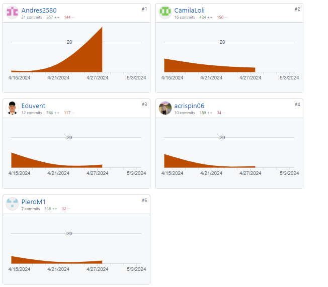

**Carrera:** Ingeniería de Software

**Nombre del curso:** Desarrollo de Aplicaciones Open Source

**Sección:** SW57

**Nombre del profesor:** Angel Velasquez

# Informe Trabajo Parcial

**Nombre del startup:** ConstruTech

**Nombre del producto:** BuildSphere

**Mes y año:** Abril 2024

**Ciclo:** 2024-01

| Nombre de los Integrantes       | Código     |
|---------------------------------|------------|
| Eduardo Renato Ventura Chancafe | u202212645 |
| Alvaro Esteban Crispin Ccancce  | U202020328 |
| Camila Cristina Loli Ramirez    | U202110385 |
| Carlos Andres Rojas Ccama       | U202217241 |
| Piero Mendoza Pimentel          | U201923446 |

## Registro de Versiones del Informe

| **Versión** |   **Fecha**    |                                                                                                              **Autor**                                                                                                              |                                                                                              **Descripción de modificación**                                                                                              |
|:-----------:|:--------------:|:-----------------------------------------------------------------------------------------------------------------------------------------------------------------------------------------------------------------------------------:|:-------------------------------------------------------------------------------------------------------------------------------------------------------------------------------------------------------------------------:|
|   **TB1**   | **09/04/2024** | 
**Ventura Chancafe, Eduardo Renato**

**Camila Cristina Loli Ramirez**

**Alvaro Esteban Crispin Ccancce**

**Carlos Andres Rojas Ccama**

**Piero Mendoza Pimentel**

 |                                                                        **Capítulo I Capítulo II Capítulo III Capítulo IV Capítulo V**                                                                         |
|   **TB2**   | **03/05/2024** | 
**Ventura Chancafe, Eduardo Renato**

**Camila Cristina Loli Ramirez**

**Alvaro Esteban Crispin Ccancce**

**Carlos Andres Rojas Ccama**

**Piero Mendoza Pimentel**

 | **Correción de los cinco capítulos presentes en el informe, acorde a lo indica la rúbrica. Asímismo, se añadió el segundo Sprint del proyecto; este se enfoca, mayormente, en el FrontEnd de la aplicación BuildSphere.** |

# Student Outcome

| Criterio Específico                                                                                                                                                                   | AccionesRealizadas                                                                                                                                                                                                                                                                                                                                                                                                                                                                                                                                                                                                                                                                                                                                                                                                                                                                                                                                                                                                                                                                                                                                                                                                                                                                                                                                                                                                                                                                                                                                | Conclusiones                                                                                                                                                                                                                                                                                                                                          |
|---------------------------------------------------------------------------------------------------------------------------------------------------------------------------------------|---------------------------------------------------------------------------------------------------------------------------------------------------------------------------------------------------------------------------------------------------------------------------------------------------------------------------------------------------------------------------------------------------------------------------------------------------------------------------------------------------------------------------------------------------------------------------------------------------------------------------------------------------------------------------------------------------------------------------------------------------------------------------------------------------------------------------------------------------------------------------------------------------------------------------------------------------------------------------------------------------------------------------------------------------------------------------------------------------------------------------------------------------------------------------------------------------------------------------------------------------------------------------------------------------------------------------------------------------------------------------------------------------------------------------------------------------------------------------------------------------------------------------------------------------|-------------------------------------------------------------------------------------------------------------------------------------------------------------------------------------------------------------------------------------------------------------------------------------------------------------------------------------------------------|
| Comunica oralmente sus ideas y/o resultados con objetividad a público de diferentes especialidades y niveles jerarquicos, en el marco del desarrollo de un proyecto en ingeniería.    | Carlos Andres Rojas Ccama  **TB1** Completado del capítulo 3 para el diseño de la pagina  **TP** Entendí que diseño de los user stories y el empathy mapping ayuda de manera significativa para la creación de una pagina    Piero Mendoza Pimentel  **TB1**  Desarrolle el formulario de Contacto de la Landing page, wireframe y mock-ups  **TP**  Desarrolle la vista de Collaboration, incluyendo la tabla trabajadores, equipos y tareas.     **Camila Loli** **TB1** Nos hemos mantenido en constante comunicación sobre la organización de las distintas tareas que componen nuestro proyecto. Asimismo, para la decisión de qué buscamos resolver con nuestra solución tuvimos que expresar ideas y preocupaciones sobre diferentes temas; de esa forma, entendimos cuál es la problemática respecto al rubro de constructoras: falta de una aplicación especializada para la gestión de proyectos. Definimos el core de la empresa, para poder tener una distinción en nuestros productos, lo que brinda a nuestros segmentos objetivos. **TP** Tuvimos discusiones más constantes para poder planificar nuestras tareas de forma más eficiente, así, evitamos los errores y discordancias que tuvimos en la primera entrega. También, se solucionaron las correcciones que recibimos en la TB1 acorde a las indicaciones del enunciado. Además, discutimos la organización de la parte frontend de nuestra aplicación web y definimos la nomenclatura a seguir, para evitar problemas.  | **TB1** Nos reunimos como equipo y decidimos las partes del proyecto de las que se encargaría cada miembro. Asimismo logramos completar la primera parte del trabajo.  **TP** Nos reunimos como equipo en distintas ocasiones para ir completando las metas propuestas para el sprint 2, lo cual ayudó a mejorar el diseño de la pagina.  |
| Comunica en forma escrita ideas y/o resultados con objetividad a público de diferentes especialidades y niveles jerárquicos, en el marco del desarrollo de un proyecto en ingeniería. | Carlos Andres Rojas Ccama **TB1** Completando algunos puntos del sprint 2  **TP** Entendí que diseño de los user stories y el empathy mapping ayuda de manera significativa para la creación de una pagina     Piero Mendoza Pimentel  **TB1**  Desarrolle los user persona basado en las entrevistas de segmentos objetivos  **TP**  Utilize el api fake para hacer get, post, delete en las tablas de Collaboration.  **Camila Loli** **TB1** Los diagramas C4 nos ayudaron a definir de forma más estable el core de nuestra empresa, qué es más significativo para los clientes para que escojan nuestra aplicación. Asimismo, pudimos delimitar las APIs a utilizar, para añadir un mejor funcionamiento a nuestra aplicación. Además, dividimos los bounded context de la aplicación, así tenemos una mejor guía de cómo vamos a construir nuestra aplicación. **TP** Investigamos distintas herramientas que nos puedan ayudar al deploy de nuestra landing page y  aplicación web. También, hicimos un gran uso de nuestra organización en la plataforma Github, al utilizar los commits pudimos tener una participación activa durante las tareas asignadas.                                                                                                                                                                                                                                                                                                                             |  **TB1** Aprendimos a usar GitHub. Además, entendimos cómo hacer commits en esta herramienta y cómo nos podrán ayudar en el desarrollo de este proyecto. **TP** Aprendimos a usar distintos componentes del Angular para la parte del frontend para nuestra pagina.                                                                    |

## Project Report Collaboration Insights

**Enlace del Project Report: https://github.com/ConstruTech-UPC/BuildSphere-Informe**

* TP: En este trabajo empezamos corregir las observaciones del primer trabajo (TB1) para tener un trabajo mejor estructurado. Asimismo, incluimos el nuevo Sprint, este consiste enteramente en el FrontEnd de la aplicación BuildSphere.

## Contenido
- [Capítulo I: Introducción](Chapters/Chapter_I/CHAPTER_I.md)
- [Capítulo II: Requirements Elicitation & Analysis](Chapters/Chapter_II/CHAPTER_II.md)
- [Capítulo III: Requirements Specification](Chapters/Chapter_III/CHAPTER_III.md)
- [Capítulo IV: Product Design](Chapters/Chapter_IV/CHAPTER_IV.md)
- [Capítulo V: Product Implementation, Validation & Deployment](Chapters/Chapter_V/CHAPTER_V.md)

