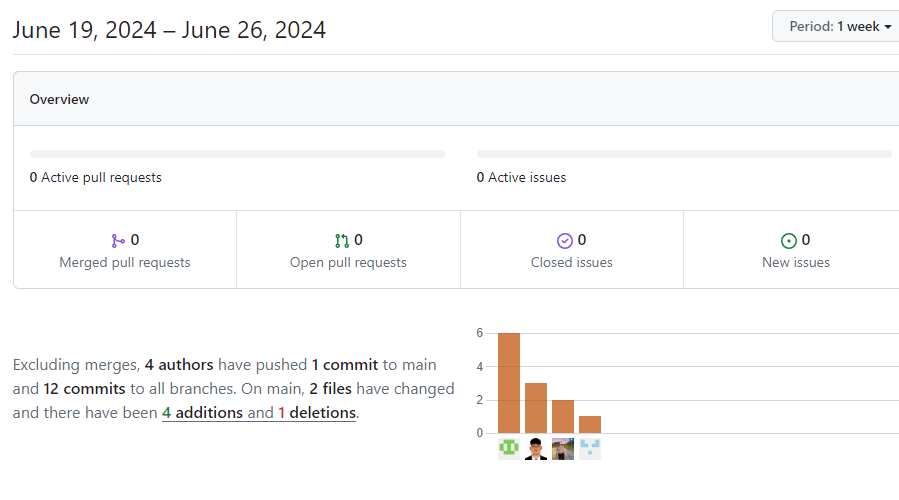

**Carrera:** Ingeniería de Software

**Nombre del curso:** Desarrollo de Aplicaciones Open Source

**Sección:** SW57

**Nombre del profesor:** Angel Velasquez

# Informe Trabajo Parcial

**Nombre del startup:** ConstruTech

**Nombre del producto:** BuildSphere

**Mes y año:** Abril 2024

**Ciclo:** 2024-01

| Nombre de los Integrantes       | Código     |
|---------------------------------|------------|
| Eduardo Renato Ventura Chancafe | u202212645 |
| Alvaro Esteban Crispin Ccancce  | U202020328 |
| Camila Cristina Loli Ramirez    | U202110385 |
| Carlos Andres Rojas Ccama       | U202217241 |
| Piero Mendoza Pimentel          | U201923446 |

## Registro de Versiones del Informe

| **Versión** |   **Fecha**    |                                                                                                              **Autor**                                                                                                              |                                                                                              **Descripción de modificación**                                                                                              |
|:-----------:|:--------------:|:-----------------------------------------------------------------------------------------------------------------------------------------------------------------------------------------------------------------------------------:|:-------------------------------------------------------------------------------------------------------------------------------------------------------------------------------------------------------------------------:|
|   **TB1**   | **09/04/2024** | 
**Ventura Chancafe, Eduardo Renato**

**Camila Cristina Loli Ramirez**

**Alvaro Esteban Crispin Ccancce**

**Carlos Andres Rojas Ccama**

**Piero Mendoza Pimentel**

 |                                                                        **Capítulo I Capítulo II Capítulo III Capítulo IV Capítulo V**                                                                         |
|   **TP**   | **03/05/2024** | 
**Ventura Chancafe, Eduardo Renato**

**Camila Cristina Loli Ramirez**

**Alvaro Esteban Crispin Ccancce**

**Carlos Andres Rojas Ccama**

**Piero Mendoza Pimentel**

 | **Correción de los cinco capítulos presentes en el informe, acorde a lo indica la rúbrica. Asímismo, se añadió el segundo Sprint del proyecto; este se enfoca, mayormente, en el FrontEnd de la aplicación BuildSphere.** |
|   **TB2**   | **03/05/2024** | 
**Ventura Chancafe, Eduardo Renato**

**Camila Cristina Loli Ramirez**

**Alvaro Esteban Crispin Ccancce**

**Carlos Andres Rojas Ccama**

**Piero Mendoza Pimentel**

 | **Correción de los cinco capítulos presentes en el informe, acorde a lo indica la rúbrica. Se hicieron unos arreglos en el frontend de la aplicación, se hicieron las entrevistas de validación y empezó el desarrollo del backend.** |
|   **TP**   | **26/06/2024** | 
**Ventura Chancafe, Eduardo Renato**

**Camila Cristina Loli Ramirez**

**Alvaro Esteban Crispin Ccancce**

**Carlos Andres Rojas Ccama**

**Piero Mendoza Pimentel**

 | **Correción de los cinco capítulos presentes en el informe, acorde a lo indica la rúbrica. Se realizaron los últimos arreglos del front end y back end, se realizó el deployment.** |

# Student Outcome

| Criterio Específico                                                                                                                                                                   | AccionesRealizadas                                                                                                                                                                                                                                                                                                                                                                                                                                                                                                                                                                                                                                                                                                                                                                                                                                                                                                                                                                                                                                                                                                                                                                                                                                                                                                                                                                                                                                                                                                                                | Conclusiones                                                                                                                                                                                                                                                                                                                                          |
|---------------------------------------------------------------------------------------------------------------------------------------------------------------------------------------|---------------------------------------------------------------------------------------------------------------------------------------------------------------------------------------------------------------------------------------------------------------------------------------------------------------------------------------------------------------------------------------------------------------------------------------------------------------------------------------------------------------------------------------------------------------------------------------------------------------------------------------------------------------------------------------------------------------------------------------------------------------------------------------------------------------------------------------------------------------------------------------------------------------------------------------------------------------------------------------------------------------------------------------------------------------------------------------------------------------------------------------------------------------------------------------------------------------------------------------------------------------------------------------------------------------------------------------------------------------------------------------------------------------------------------------------------------------------------------------------------------------------------------------------------|-------------------------------------------------------------------------------------------------------------------------------------------------------------------------------------------------------------------------------------------------------------------------------------------------------------------------------------------------------|
| Comunica oralmente sus ideas y/o resultados con objetividad a público de diferentes especialidades y niveles jerarquicos, en el marco del desarrollo de un proyecto en ingeniería.    | 
**Alvaro Esteban Crispin Ccancce**  **TP**  Participó en la creación del feature de documentos, explorando nuevas formas de presentación y organización de la información para mejorar la experiencia del usuario.  **TB2**  Participó en la creación de los endpoints para el acceso a los documentos del feature Documents. Adicionalmente, realizó la estilización del feature antes mencionado.   **Eduardo Renato Ventura Chancafe**  **TP**   Participó en la creación del feature de project-management, incluyendo el despliegue del front end en Netlify. Exploró nuevas formas de gestión y visualización de proyectos para mejorar la experiencia del usuario.   **TB2**   Desarrolló el service del bounded context project-management y realizó el despliegue en Railway. Además, se encargó de estilizar y optimizar la funcionalidad del feature mencionado.
   **Carlos Andres Rojas Ccama**  **TB1** Completado del capítulo 3 para el diseño de la pagina  **TP** Entendí que diseño de los user stories y el empathy mapping ayuda de manera significativa para la creación de una pagina **TB2**  Durante el TB2 estuve completando el sprint 3 es decir estuve haciendo el IAM backend  **Piero Mendoza Pimentel** **TB1**  Desarrolle el formulario de Contacto de la Landing page, wireframe y mock-ups  **TP**  Desarrolle la vista de Collaboration, incluyendo la tabla trabajadores, equipos y tareas.  **TB2**  Desarrolle el bounded context Operations Managements donde cree los endpoints /api/v1/teams y /api/v1/workers con su solicitudes GET, PUT y DELETE respectivas   **TF**  Desarrolle el bounded context Operations Managements donde cree el endpoints /api/v1/tasks con su solicitudes GET, PUT y DELETE respectivas. Ademas me encargue en el backend el bounded context de IAM asi como su implementacion en el proyecto     **Camila Loli** **TB1** Nos hemos mantenido en constante comunicación sobre la organización de las distintas tareas que componen nuestro proyecto. Asimismo, para la decisión de qué buscamos resolver con nuestra solución tuvimos que expresar ideas y preocupaciones sobre diferentes temas; de esa forma, entendimos cuál es la problemática respecto al rubro de constructoras: falta de una aplicación especializada para la gestión de proyectos. Definimos el core de la empresa, para poder tener una distinción en nuestros productos, lo que brinda a nuestros segmentos objetivos. **TP** Tuvimos discusiones más constantes para poder planificar nuestras tareas de forma más eficiente, así, evitamos los errores y discordancias que tuvimos en la primera entrega. También, se solucionaron las correcciones que recibimos en la TB1 acorde a las indicaciones del enunciado. Además, discutimos la organización de la parte frontend de nuestra aplicación web y definimos la nomenclatura a seguir, para evitar problemas.  **TB2**   Se ha coordinado las reuniones para poder planear el sprint 3. Nos dedicamos a definir de forma más concisa la lógica de negocios, para implementarlo en cada bounded context.   **TF**   Se planificaron reuniones constantes para la unión del back end y el front end para realizar el deploy. Logramos definir los endpoints de manera correcta para su funcionalidad. | **TB1** Nos reunimos como equipo y decidimos las partes del proyecto de las que se encargaría cada miembro. Asimismo logramos completar la primera parte del trabajo.  **TP** Nos reunimos como equipo en distintas ocasiones para ir completando las metas propuestas para el sprint 2, lo cual ayudó a mejorar el diseño de la pagina.  **TB2** La comunicación constante nos permitió definir nuestra lógica de negocios, de esa forma podemos planificar el backend de forma correcta.    **TF**   Realizamos las últimas mejoras para en front ened y back end, aprendimos a mejorar la comunicación y cómo realizar la aplicación open source de manera correcta.  
| Comunica en forma escrita ideas y/o resultados con objetividad a público de diferentes especialidades y niveles jerárquicos, en el marco del desarrollo de un proyecto en ingeniería. | 
**Alvaro Esteban Crispin Ccancce**   **TP**   Analizó los comentarios y sugerencias de los usuarios durante las fases de prueba, extrayendo insights clave para orientar futuras mejoras en la comunicación y usabilidad de la plataforma.  **TB2**   Realizó el análisis de los comentarios de los usuarios para su futura implementación de mejoras para el sistema.
  **Eduardo Renato Ventura Chancafe**   **TP**   Revisó y analizó los comentarios y sugerencias de los usuarios durante las fases de prueba del feature project-management. Extrajo información valiosa para guiar futuras mejoras en la usabilidad y comunicación de la plataforma.  **TB2**   Evaluó los comentarios de los usuarios con el objetivo de planificar y ejecutar mejoras en el sistema dentro del bounded context project-management. 
  **Carlos Andres Rojas Ccama** **TB1** Completando algunos puntos del sprint 2  **TP** Entendí que diseño de los user stories y el empathy mapping ayuda de manera significativa para la creación de una pagina    **TB2** Como grupo hemos empezado a desarrollar el backend del trabajo para este sprint   **Piero Mendoza Pimentel** **TB1**  Desarrolle los user persona basado en las entrevistas de segmentos objetivos  **TP**  Utilize el api fake para hacer get, post, delete en las tablas de Collaboration. **TB2**  Desarrolle parte de las preguntas de entrevistas de validacion para poder obtener retroalimentacion de nuestras mejoras aplicadas en el FrondEnd   **TB2**  Me envargue del despliegue del back end  **Camila Loli** **TB1** Los diagramas C4 nos ayudaron a definir de forma más estable el core de nuestra empresa, qué es más significativo para los clientes para que escojan nuestra aplicación. Asimismo, pudimos delimitar las APIs a utilizar, para añadir un mejor funcionamiento a nuestra aplicación. Además, dividimos los bounded context de la aplicación, así tenemos una mejor guía de cómo vamos a construir nuestra aplicación. **TP** Investigamos distintas herramientas que nos puedan ayudar al deploy de nuestra landing page y  aplicación web. También, hicimos un gran uso de nuestra organización en la plataforma Github, al utilizar los commits pudimos tener una participación activa durante las tareas asignadas.  **TB2**   Empezamos el backend, decidimos enfocarnos en los features core de la empresa, que es lo que interesa al cliente. Asimismo, se realizaron los videos About the team y About the product para que sean incluidos en la landing page.   **TF**   La creación de un Unit Test nos permitió entender porqué son tan importantes para el desarrollo de una aplicación, debido a que nos confirma la funcionalidad del producto.                                                                                                                                                                                                                                                                                                                           |  **TB1** Aprendimos a usar GitHub. Además, entendimos cómo hacer commits en esta herramienta y cómo nos podrán ayudar en el desarrollo de este proyecto. **TP** Aprendimos a usar distintos componentes del Angular para la parte del frontend para nuestra pagina.  **TB2**   Mejoramos la comunicación en equipo, definimos el sprint de manera más organizada.  **TF**   Aprendimos a cómo manejar front end y back end para una aplicación open source, reconocimos qué se necesita para la construcción de uno.                                                            | 

## Project Report Collaboration Insights

**Enlace del Project Report: https://github.com/ConstruTech-UPC/BuildSphere-Informe**

* TF: Se terminó el desarrollo del front end y back end, se realizó el deployment.

## Contenido
- [Capítulo I: Introducción](Chapters/Chapter_I/CHAPTER_I.md)
- [Capítulo II: Requirements Elicitation & Analysis](Chapters/Chapter_II/CHAPTER_II.md)
- [Capítulo III: Requirements Specification](Chapters/Chapter_III/CHAPTER_III.md)
- [Capítulo IV: Product Design](Chapters/Chapter_IV/CHAPTER_IV.md)
- [Capítulo V: Product Implementation, Validation & Deployment](Chapters/Chapter_V/CHAPTER_V.md)

